# SumUp MDB Payment System

> **Proof of Concept** for integrating SumUp payments with MDB Vending Machines using a Raspberry Pi.

This project provides a complete software stack to modernize vending machines by replacing or augmenting the coin mechanism with a QR-code based payment system.

## 🚀 Features

-   **MDB Protocol Support**: Acts as a Cashless Device (Level 3) via Qibixx Pi Hat.
-   **SumUp Integration**: Generates dynamic QR codes for payments.
-   **Modern UI**: React-based interface for DSI touchscreens.
-   **Simulation Mode**: Develop and test without physical hardware.

## 🛠️ System Architecture

The system consists of a Python Backend (FastAPI) managing the hardware and payment logic, and a React Frontend displaying the user interface.

```mermaid
%%{init: {'theme':'dark', 'themeVariables': { 'fontSize':'20px'}}}%%
graph LR
    VMC["🏪 Vending Machine"]
    Pi["💻 Raspberry Pi"]
    SumUp["☁️ SumUp API"]
    Screen["📺 Touch Screen"]
    
    VMC -->|MDB| Pi
    Pi -->|HTTPS| SumUp
    Pi -->|HDMI/DSI| Screen
```



## 📚 Documentation Guide

| Section | Description |
| :--- | :--- |
| [**Architecture**](architecture.md) | Deep dive into the data flow and component interaction. |
| [**Hardware Setup**](hardware_setup.md) | Wiring guide for Qibixx Hat and Raspberry Pi. |
| [**API Reference**](api_reference.md) | WebSocket events and Debug API endpoints. |
| [**User Guide**](user_guide.md) | Installation, usage, and troubleshooting. |

## ⚡ Quick Start

```bash
# Clone the repo
git clone https://github.com/your-repo/sumup-mdb-qibixx.git

# Run the system
./run.sh
```

Check the [User Guide](user_guide.md) for detailed instructions.
