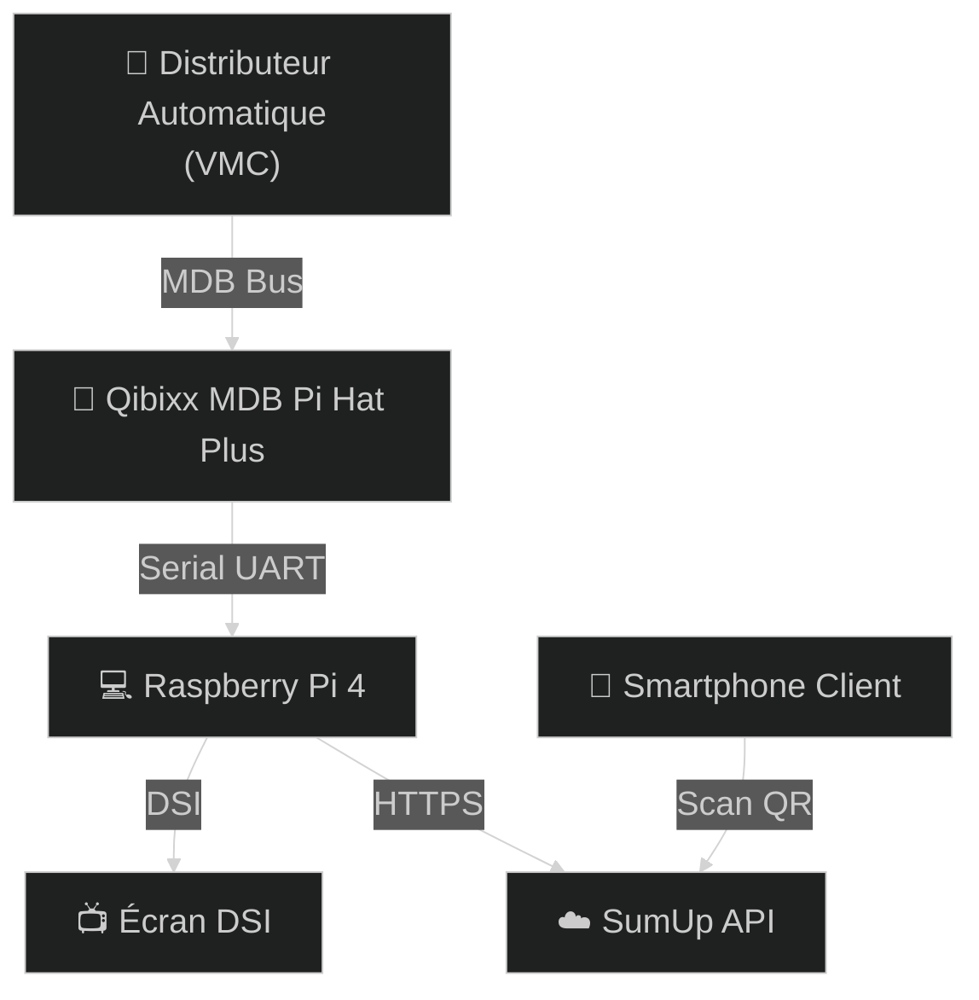
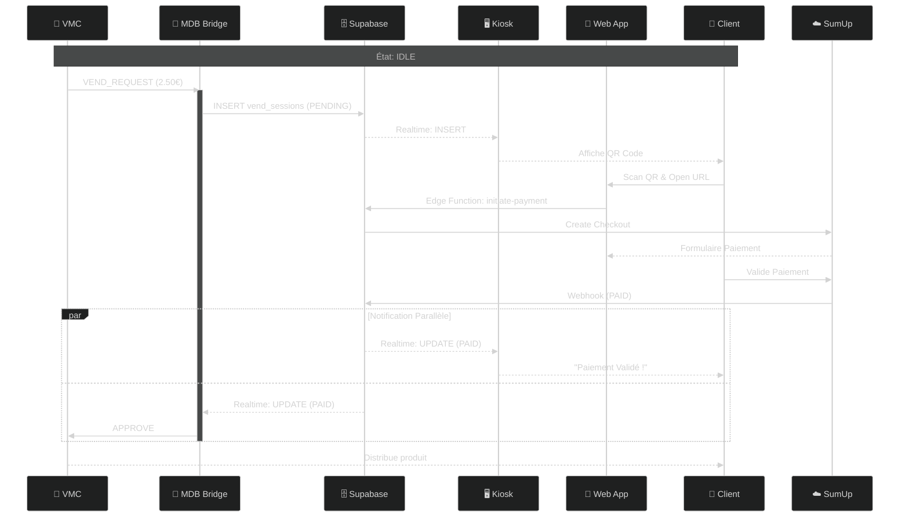

# Architecture & Flux de Données

Ce document détaille l'architecture technique du système de paiement SumUp MDB.

## Vue d'ensemble du Système

### Le Problème
Les distributeurs automatiques traditionnels acceptent uniquement les pièces et billets. Ce système permet d'ajouter le **paiement par QR Code** via SumUp.

### La Solution
Le Raspberry Pi se branche entre le distributeur (VMC) et remplace le monnayeur classique :

1. **Le client appuie sur un bouton** du distributeur (ex: "Coca-Cola 2.50€")
2. **Le distributeur demande au Raspberry Pi** de collecter 2.50€
3. **Le Raspberry Pi affiche un QR Code** sur l'écran tactile
4. **Le client scanne et paie** avec son téléphone via SumUp
5. **Le Raspberry Pi confirme au distributeur** que le paiement est OK
6. **Le distributeur libère le produit**

### Les Composants Physiques

| Composant | Rôle |
|-----------|------|
| **🏪 Distributeur (VMC)** | La machine qui contient les produits. Elle "parle" en protocole MDB. |
| **🔌 Qibixx Pi Hat** | Carte électronique qui traduit le MDB en Serial pour le Raspberry Pi. |
| **💻 Raspberry Pi** | Le cerveau du système. Gère les paiements SumUp et l'affichage. |
| **📺 Écran DSI** | Affiche le QR Code et les instructions au client. |
| **☁️ SumUp API** | Service cloud qui génère les QR Codes et traite les paiements. |

### Schéma de Connexion



## Architecture Logicielle (Raspberry Pi)

### Les Trois Applications

Le système repose sur **trois composants logiciels** interconnectés via Supabase :

| Composant | Technologie | Rôle |
|-----------|-------------|------|
| **🐍 MDB Bridge** | Python (Script Listener) | Gère le matériel (MDB) et écoute les ordres de Supabase. |
| **🖥️ Kiosk** | React + Vite | Interface affichée sur l'écran du distributeur. Écoute Supabase pour afficher les QR. |
| **📱 Web App** | React + Vite | Interface de paiement sur le téléphone du client. Initie les transactions SumUp. |

### Le Hub Central : Supabase

Contrairement à une architecture classique Client-Serveur, ici **tout passe par Supabase**. Il n'y a pas de communication directe entre le Backend Python et le Frontend React.

*   **Database** : Stocke l'état des sessions de vente (`vend_sessions`).
*   **Realtime** : Notifie le Backend et le Frontend des changements (ex: nouveau QR code, paiement validé).
*   **Edge Functions** : Gère la logique métier sécurisée (création checkout SumUp, webhooks).

### Schéma du Flux de Données

```mermaid
%%{init: {'theme':'dark', 'themeVariables': { 'fontSize':'20px'}}}%%
graph LR
    MDB["📡 Service MDB"]
    Bridge["🐍 MDB Bridge"]
    Supabase["🗄️ Supabase (DB + Realtime)"]
    Kiosk["🖥️ Kiosk (Display)"]
    WebApp["📱 Web App (Client)"]
    SumUp["☁️ SumUp API"]

    %% Flux Vente
    MDB -->|1. VEND_REQ| Bridge
    Bridge -->|2. INSERT session| Supabase
    Supabase -->|3. Realtime INSERT| Kiosk
    Kiosk -->|4. Affiche QR| Kiosk
    
    %% Flux Paiement
    WebApp -->|5. Scan QR & Pay| Supabase
    Supabase -->|6. Call Edge Function| SumUp
    SumUp -->|7. Webhook (PAID)| Supabase
    
    %% Flux Validation
    Supabase -->|8. Realtime UPDATE (PAID)| Bridge
    Supabase -->|9. Realtime UPDATE (PAID)| Kiosk
    Bridge -->|10. APPROVE| MDB
```

## Diagramme de Séquence : Flux de Paiement

### Le Parcours Complet d'une Transaction

1.  **Demande (VMC -> Bridge)** : Le distributeur demande un paiement (ex: 2.50€).
2.  **Création Session (Bridge -> Supabase)** : Le Bridge crée une ligne dans `vend_sessions` avec `status='PENDING'`.
3.  **Affichage (Supabase -> Kiosk)** : Le Kiosk reçoit l'événement `INSERT` et affiche le QR Code correspondant à la session.
4.  **Paiement (Client -> Web App)** : Le client scanne le QR code, ouvre la Web App, et paie via SumUp.
5.  **Validation (SumUp -> Supabase)** : SumUp notifie Supabase (via Webhook) que le paiement est réussi. Le statut passe à `PAID`.
6.  **Distribution (Supabase -> Bridge)** : Le Bridge reçoit l'événement `UPDATE` (`status='PAID'`) et envoie la commande `APPROVE` au distributeur.

### Diagramme Technique


