```mermaid
%%{init: {'theme':'dark', 'themeVariables': { 'fontSize':'20px'}}}%%
sequenceDiagram
    participant VMC as 🏪 VMC
    participant Backend as 🐍 Backend
    participant Supabase as 🗄️ Supabase
    participant Frontend as 🖥️ Frontend
    participant User as 👤 Client
    participant Edge as ⚡ Edge Functions
    participant SumUp as ☁️ SumUp

    Note over VMC,User: État: IDLE

    VMC->>Backend: VEND_REQUEST (2.50€)
    activate Backend
    Backend->>Supabase: INSERT vend_sessions (PENDING)
    Supabase-->>Frontend: Realtime: INSERT
    Frontend-->>User: Affiche QR Code
    
    User->>Edge: initiate-wallet-recharge
    Edge->>SumUp: Create Checkout
    SumUp-->>User: Formulaire Paiement
    
    User->>SumUp: Valide Paiement
    SumUp->>Edge: Webhook (PAID)
    Edge->>Supabase: UPDATE transactions (COMPLETED)
    
    User->>Edge: process-payment (Pay Coffee)
    Edge->>Supabase: UPDATE vend_sessions (PAID)
    
    Supabase-->>Backend: Realtime: UPDATE (PAID)
    Backend->>VMC: APPROVE
    deactivate Backend
    
    VMC-->>User: Distribue produit
```

# Architecture & Flux de Données

Ce document détaille l'architecture technique du système de paiement SumUp MDB.

## Vue d'ensemble du Système

### Le Problème
Les distributeurs automatiques traditionnels acceptent uniquement les pièces et billets. Ce système permet d'ajouter le **paiement par QR Code** via SumUp.

### La Solution
Le Raspberry Pi se branche entre le distributeur (VMC) et remplace le monnayeur classique :

1. **Le client appuie sur un bouton** du distributeur (ex: "Coca-Cola 2.50€")
2. **Le distributeur demande au Raspberry Pi** de collecter 2.50€
3. **Le Raspberry Pi affiche un QR Code** sur l'écran tactile
4. **Le client scanne et paie** avec son téléphone via SumUp
5. **Le Raspberry Pi confirme au distributeur** que le paiement est OK
6. **Le distributeur libère le produit**

### Les Composants Physiques

| Composant | Rôle |
|-----------|------|
| **🏪 Distributeur (VMC)** | La machine qui contient les produits. Elle "parle" en protocole MDB. |
| **🔌 Qibixx Pi Hat** | Carte électronique qui traduit le MDB en Serial pour le Raspberry Pi. |
| **💻 Raspberry Pi** | Le cerveau du système. Gère les paiements SumUp et l'affichage. |
| **📺 Écran DSI** | Affiche le QR Code et les instructions au client. |
| **☁️ SumUp API** | Service cloud qui génère les QR Codes et traite les paiements. |

### Schéma de Connexion

```mermaid
%%{init: {'theme':'dark', 'themeVariables': { 'fontSize':'20px'}}}%%
graph TB
    VMC["🏪 Distributeur Automatique<br/>(VMC)"]
    Qibixx["🔌 Qibixx MDB Pi Hat Plus"]
    RPi["💻 Raspberry Pi 4"]
    Screen["📺 Écran DSI"]
    SumUpAPI["☁️ SumUp API"]
    UserPhone["📱 Smartphone Client"]

    VMC -->|MDB Bus| Qibixx
    Qibixx -->|Serial UART| RPi
    RPi -->|DSI| Screen
    RPi -->|HTTPS| SumUpAPI
    UserPhone -->|Scan QR| SumUpAPI
```



## Architecture Logicielle (Raspberry Pi)

### Les Deux Applications

Le Raspberry Pi fait tourner **deux programmes en parallèle** :

| Programme | Technologie | Rôle |
|-----------|-------------|------|
| **🐍 Backend** | Python + FastAPI | Communique avec le distributeur (MDB) et SumUp. C'est le "chef d'orchestre". |
| **🖥️ Frontend** | React + Vite | Affiche l'interface graphique sur l'écran tactile. |

### Comment Ils Communiquent

Les deux programmes se parlent via **WebSocket** (connexion temps réel) :

1. **Le Backend reçoit** une demande du distributeur via MDB
2. **Le Backend envoie** un message WebSocket au Frontend : "Affiche l'écran de paiement"
3. **Le Frontend affiche** le QR Code à l'écran
4. **Le Backend contacte** SumUp pour créer le paiement
5. **Le Backend envoie** le QR Code au Frontend via WebSocket
6. **Le Frontend affiche** le QR Code au client

### Schéma du Flux de Données

```mermaid
%%{init: {'theme':'dark', 'themeVariables': { 'fontSize':'20px'}}}%%
graph LR
    MDB["📡 Service MDB"]
    Payment["💳 Web App (Client)"]
    API["🔌 Backend (Listener)"]
    Supabase["🗄️ Supabase DB"]
    Edge["⚡ Edge Functions"]
    UI["🖥️ Frontend (Kiosk)"]

    MDB -->|1. VEND_REQ| API
    API -->|2. INSERT vend_sessions| Supabase
    Supabase -->|3. Realtime INSERT| UI
    UI -->|4. Affiche QR| UI
    
    Payment -->|5. Scan QR & Pay| Edge
    Edge -->|6. initiate-wallet-recharge| Supabase
    Edge -->|7. handle-sumup-webhook| Supabase
    Edge -->|8. process-payment| Supabase
    
    Supabase -->|9. Realtime UPDATE (PAID)| API
    API -->|10. APPROVE| MDB
```

## Diagramme de Séquence : Flux de Paiement

### Le Parcours Complet d'une Transaction

Voici ce qui se passe **étape par étape** quand un client achète un produit :

#### Phase 1 : Demande de Paiement
1. **Le client appuie** sur le bouton "Coca-Cola" du distributeur
2. **Le distributeur (VMC) envoie** au Backend : "Je veux 2.50€"
3. **Le Backend dit** au Frontend : "Passe en mode PROCESSING"
4. **L'écran affiche** : "Chargement..."

#### Phase 2 : Génération du QR Code
5. **Le Backend contacte** l'API SumUp : "Crée un paiement de 2.50€"
6. **SumUp répond** avec un QR Code unique
7. **Le Backend envoie** le QR Code au Frontend
8. **L'écran affiche** le QR Code en grand

#### Phase 3 : Paiement Client
9. **Le client scanne** le QR Code avec son téléphone
10. **Le client paie** via l'application SumUp
11. **Le Backend vérifie** régulièrement auprès de SumUp : "C'est payé ?"
12. **SumUp confirme** : "Oui, paiement validé !"

#### Phase 4 : Distribution du Produit
13. **Le Backend dit** au Frontend : "Passe en mode SUCCESS"
14. **L'écran affiche** : "Paiement validé !"
15. **Le Backend dit** au distributeur : "APPROVE - Libère le produit"
16. **Le distributeur distribue** le Coca-Cola

### Diagramme Technique

### Diagramme Technique


